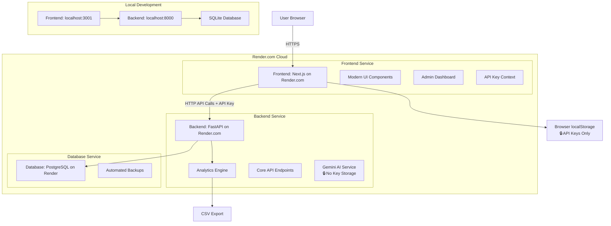

# System Patterns: GenAI Content Detection Assistant

## 1. System Architecture

The system follows a modern containerized client-server architecture with enterprise-grade security, enhanced analytics, production cloud deployment on Render.com:

*   **Frontend (Client):** A production-ready Next.js single-page application (SPA) deployed on Render.com and running in users' browsers. It interacts with the backend via HTTP API calls, includes comprehensive admin tools with real-time analytics, AND manages API keys securely in browser-only storage.
*   **Backend (Server):** A FastAPI (Python) application deployed on Render.com providing a RESTful API with enhanced analytics endpoints and zero API key storage for enhanced security. It handles business logic, database interactions, performance tracking, and data export capabilities.
*   **Database:** PostgreSQL database (production) / SQLite (development) stores application data (URLs, tasks, labels, users) with proper persistence and cloud backup. API keys are intentionally NOT stored for security.
*   **Cloud Infrastructure:** Both frontend and backend applications are deployed on Render.com using Docker containers with automated CI/CD and proper environment management.
*   **Security Model:** API keys maintained exclusively in frontend localStorage, passed with requests but never persisted server-side.
*   **CORS Configuration:** Proper cross-origin resource sharing setup for production frontend-backend communication across different domains.

## 2. Key Technical Decisions

*   **FastAPI (Backend):** Chosen for its high performance, ease of use, automatic data validation (Pydantic), and built-in OpenAPI/Swagger documentation. Enhanced with analytics endpoints for performance tracking AND zero API key storage for security.
*   **Next.js (Frontend):** Chosen for its powerful features for building modern React applications, with production-ready build optimizations, component-based architecture, AND secure client-side state management.
*   **Frontend-Only API Key Storage:** Critical security decision to move API key storage from backend database to browser localStorage only, ensuring server never persists sensitive credentials.
*   **Tailwind CSS (Frontend):** Chosen for its utility-first approach, enabling rapid UI development and easy customization. Used to create modern, responsive interfaces.
*   **SQLite (Database):** Chosen for its simplicity and file-based nature for PoC. Enhanced with proper volume mounting for persistence AND API key column removal for security.
*   **Docker & Docker Compose:** Enhanced with production-grade multi-stage builds, security hardening, and optimized image sizes for reliable deployment.
*   **Analytics Architecture:** Separated analytics logic into dedicated endpoints to maintain clean separation of concerns and enable advanced performance tracking.

## 3. Design Patterns in Use

*   **RESTful API Design:** The backend API follows REST principles with enhanced analytics endpoints (`/analytics/*`) and secure API key handling.
*   **Repository Pattern (Conceptual):** Database interaction logic is separated into specific modules with optimized queries for analytics and security compliance.
*   **Component-Based Architecture (Frontend):** The Next.js frontend is built using reusable React components with modern patterns like collapsible sections and tag-based interfaces.
*   **Security-First Context Pattern:** React Context (`ApiKeyContext`) manages sensitive API keys in frontend-only scope with secure localStorage integration.
*   **Request-Scoped Security:** API keys passed with individual requests but never persisted server-side, maintaining zero-trust security model.
*   **Analytics Service Pattern:** Dedicated analytics service layer for performance tracking, metrics calculation, and data export functionality.
*   **Multi-Stage Docker Builds:** Production-ready builds with optimized and secure Docker images, especially for the frontend with proper dependency management.
*   **Configuration Management Pattern:** Global YAML configuration file shared between backend and frontend for consistent settings.

## 4. Component Relationships

*   **Enhanced Frontend Components:** 
    *   `Layout` wraps all pages with consistent navigation and authentication
    *   `ApiKeyProvider` wraps application with secure API key context management
    *   `ApiKeyManager` handles frontend-only API key storage and validation
    *   `Navbar` provides role-based navigation with admin tools
    *   Admin components (`AdminDashboard`, `UrlUploadForm`, `AnalyticsView`) handle comprehensive admin functionality
    *   Labeler components (`TaskView`, `LabelingForm`) with modern indicator interface using tag-based selection AND secure API key integration
    *   Analytics components (`PerformanceTable`, `ExportInterface`) for performance tracking and data export
*   **Enhanced Backend Modules (Located in `backend/src/`):**
    *   `main.py`: FastAPI app with core endpoints plus enhanced analytics endpoints AND secure API key handling
    *   `models.py`: SQLAlchemy database models with proper relationships (API key fields removed for security)
    *   `schemas.py`: Pydantic schemas including analytics response models AND API key request schemas
    *   `database.py`: Database engine with optimized connection handling
    *   `ai_service.py`: Google Gemini AI integration for content analysis with request-scoped API keys
    *   `config.py`: Global configuration management utilities
    *   **Analytics Module**: Performance tracking, metrics calculation, and export functionality
    *   **Security Module**: Zero-persistence API key handling and secure request processing
*   **Production Docker Configuration:**
    *   Multi-stage frontend Dockerfile with security hardening and optimization
    *   Backend Docker configuration with proper Python path and Poetry integration
    *   docker-compose.yml with proper service communication and volume management

## 5. Critical Implementation Paths

1.  **Secure Analytics Workflow:** URL upload → task assignment → labeling completion (with secure API key) → performance tracking → analytics dashboard → data export is the complete analytics pipeline.
2.  **Security-First API Path:** Frontend API key storage → request composition → backend processing → immediate disposal (zero persistence).
3.  **Production Docker Pipeline:** Code → multi-stage build → optimized container → service orchestration → network communication → persistent storage.
4.  **User Experience Flow:** Login → role-based interface → API key setup → task management → modern indicator selection → submission → real-time feedback.
5.  **Admin Management Flow:** Dashboard → analytics view → URL management → performance tracking → data export → system monitoring.
6.  **Database Persistence Path:** Ensuring SQLite database file persists between container restarts with proper volume mounting configuration.
7.  **API Integration Path:** Frontend → authentication + API key → backend APIs → analytics processing → data visualization → user feedback.

## 6. Security Architecture

*   **Zero Backend Storage:** API keys never stored in database, configuration files, or server memory beyond request scope.
*   **Frontend-Only Persistence:** API keys stored securely in browser localStorage with proper cleanup and validation.
*   **Request-Scoped Processing:** API keys passed with individual AI analysis requests but immediately discarded after use.
*   **Migration Compliance:** Database migration script safely removes existing API key storage with verification and rollback capabilities.
*   **User Control:** Users maintain complete ownership and control over their API credentials with no server dependency.

## 7. Analytics Architecture

*   **Performance Tracking:** Real-time calculation of labeling velocity, accuracy trends, and individual performance metrics.
*   **Data Aggregation:** SQL-based analytics with proper aggregation queries for system-wide and individual statistics.
*   **Export Functionality:** CSV export with configurable date ranges and comprehensive labeling data.
*   **Real-time Dashboard:** Live updating admin dashboard with key performance indicators and system health metrics.

## 8. Form Validation and User Feedback Patterns

*   **Client-Side Validation Strategy:**
    *   Real-time validation with immediate feedback for user input
    *   Custom validation rules with regex patterns for complex requirements
    *   Error state management using React useState for individual form fields
    *   Progressive validation clearing as users correct their input
*   **User Experience Patterns:**
    *   **Error Message Display**: Consistent error messaging using `errorMessage` prop in Input components
    *   **Visual Feedback**: Red-colored error text positioned below input fields for clear association
    *   **Icon Integration**: Proper `leftIcon` positioning for visual context and improved UX
    *   **Loading States**: Disabled form elements and loading indicators during submission
*   **Validation Rule Implementation:**
    *   **Username Validation**: Minimum length + character restrictions using regex patterns
    *   **Password Complexity**: Multi-factor validation (length, uppercase, lowercase, digits)
    *   **Confirmation Fields**: Real-time matching validation for password confirmation
    *   **Required Field Validation**: Clear messaging for empty required fields
*   **Component Integration Patterns:**
    *   Reusable Input component with built-in error display capabilities
    *   Consistent prop naming (`errorMessage`, `leftIcon`) across all form components
    *   State management pattern for validation errors using Record<string, string>
    *   Form submission prevention until all validation passes

## 9. Production Readiness Patterns

*   **Security Hardening:** Non-root Docker users, optimized image sizes, proper secret management, AND zero API key persistence.
*   **Scalability Considerations:** Component-based architecture ready for horizontal scaling, database ready for migration to PostgreSQL.
*   **Monitoring Ready:** Structured logging, error handling, and performance metrics collection in place.
*   **Deployment Ready:** Production Docker builds, environment variable management, and service orchestration configured.
*   **Enterprise Security:** Frontend-only API key management meets enterprise privacy and security requirements. 