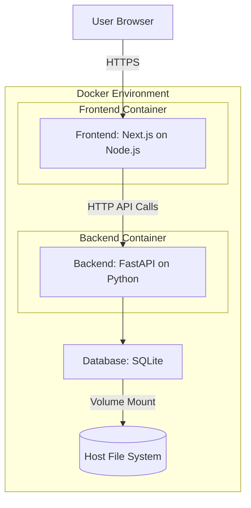

# System Patterns: GenAI Content Detection Assistant

## 1. System Architecture

The system follows a classic client-server architecture:

*   **Frontend (Client):** A Next.js single-page application (SPA) running in the user's browser. It interacts with the backend via HTTP API calls.
*   **Backend (Server):** A FastAPI (Python) application providing a RESTful API. It handles business logic, database interactions, and serves some basic HTML templates if needed (though primarily an API).
*   **Database:** An SQLite database stores application data (URLs, tasks, labels, users).
*   **Containerization:** Both frontend and backend applications are containerized using Docker and orchestrated with Docker Compose for local development and deployment.

## 2. Key Technical Decisions

*   **FastAPI (Backend):** Chosen for its high performance, ease of use, automatic data validation (Pydantic), and built-in OpenAPI/Swagger documentation.
*   **Next.js (Frontend):** Chosen for its powerful features for building modern React applications, including server-side rendering (SSR) / static site generation (SSG) capabilities (though primarily used for client-side rendering in this PoC), routing, and a good developer experience.
*   **Tailwind CSS (Frontend):** Chosen for its utility-first approach, enabling rapid UI development and easy customization without writing extensive custom CSS.
*   **SQLite (Database):** Chosen for its simplicity, file-based nature, and ease of setup for a PoC. No external database server is required.
*   **Docker & Docker Compose:** Chosen for consistent development and deployment environments, simplifying setup and dependency management across different machines.
*   **Python for Backend:** A widely used language with a rich ecosystem of libraries, suitable for web development and data handling.
*   **TypeScript for Frontend:** Adds static typing to JavaScript, improving code quality, maintainability, and developer productivity.

## 3. Design Patterns in Use

*   **RESTful API Design:** The backend API aims to follow REST principles for resource management.
*   **Repository Pattern (Conceptual):** While not strictly implemented with interfaces for a PoC, the database interaction logic in the backend will be separated into specific modules/functions, acting like repositories for data access.
*   **Component-Based Architecture (Frontend):** The Next.js frontend is built using reusable React components.
*   **Client-Side State Management (Frontend):** React's `useState` and `useEffect` hooks are used for managing component-level state. Global state management (like Redux or Zustand) is not planned for the PoC unless a clear need arises.
*   **Multi-Stage Docker Builds:** Used to create optimized and smaller production Docker images, especially for the frontend (separating build environment from runtime environment).

## 4. Component Relationships

*   **Frontend Components:** 
    *   `Layout` wraps all pages, providing consistent structure (Navbar, main content area).
    *   `Navbar` provides navigation links.
    *   Admin pages/components (`UrlUploadForm`, `AdminUploadPage`, `ApiKeyManager`, `ContentAnalyzer`) handle URL submission and AI key management.
    *   Labeler pages/components (`TaskView`, `LabelingForm`, `LabelerTaskPage`) handle task display, website iframe, and label submission.
*   **Backend Modules (Located in `backend/src/`):
    *   `main.py`: FastAPI app initialization, API endpoint definitions, Jinja2 template configuration.
    *   `models.py`: SQLAlchemy database models (User, Website, Label, Tag).
    *   `schemas.py`: Pydantic schemas for request/response validation and serialization.
    *   `database.py`: Database engine setup, `SessionLocal`, `Base` for models, `get_db` dependency, `create_db_and_tables` utility.
    *   `ai_service.py`: Google Gemini AI integration for content analysis, web scraping, and AI-powered content detection.
    *   `config.py`: Global configuration loading and management utilities.
    *   (No explicit `routers/` or `crud.py` modules yet; logic is currently within `main.py` for PoC).
*   **Scripts (Located in `scripts/` at project root):
    *   `init_db.py`: Script to initialize the database schema and add default users. Interacts with modules in `backend/src/`.

## 5. Critical Implementation Paths

1.  **Database Persistence (Current Critical Issue):** Ensuring SQLite database file persists between container restarts is essential for system reliability. The current volume mount configuration needs investigation.
2.  **AI Integration Workflow:** The complete path from API key management → content analysis request → Gemini AI processing → result storage is critical for the core value proposition.
3.  **Labeling Workflow End-to-End:** This is the core functionality. Ensuring smooth data flow from URL upload (admin) → task assignment (labeler) → label submission (labeler) → database storage is critical.
4.  **Database Schema and Initialization:** A correct and robust database schema is essential for storing data accurately. The `init_db.py` script is critical for setting up the application for the first time.
5.  **API Endpoint Integrity:** Ensuring all API endpoints behave as expected, with correct request handling, validation, and response generation.
6.  **Frontend-Backend Integration:** Correctly calling backend APIs from the frontend and handling responses (including errors).
7.  **Docker Configuration:** Ensuring `Dockerfile`s and `docker-compose.yml` are correctly configured for both development and (eventual) production builds. 